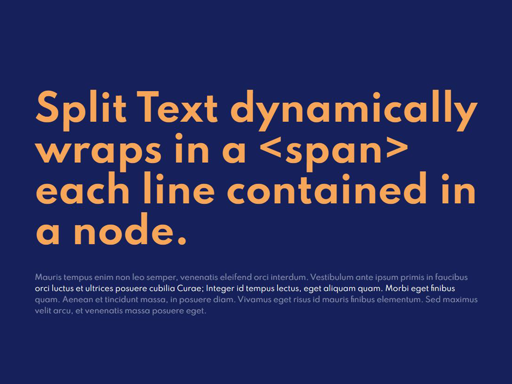

# SplitText
 👕 SplitText dynamically wraps in a &lt;span&gt; each line contained in a node.

## Overview


## Usage
### HTML
```html
<h1 class="split-text">Lorem ipsum dolor sit amet</h1>
```

### CSS
```css
.split-text > .line {
    display: block;
}
```

### JS
```js
import SplitText from "./SplitText";

window.onload = () => {
  document.querySelectorAll(".split-text").forEach(el => new SplitText(el));
};
```